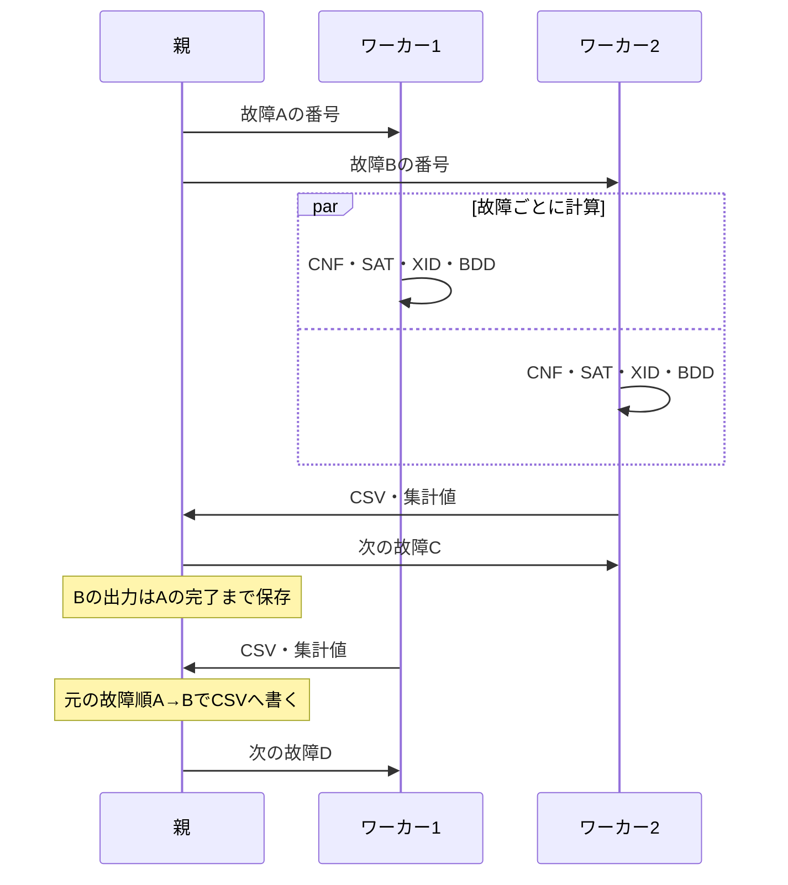

# baselineの故障並列化

baselineへverificationの常駐プロセス方式を移植した。
最新baselineの故障順事前整列、BDD計算とCSV出力の分離を生かし、
正常CNF限定と直接の`ccadical_add()`を維持する。対象は既存のSAF/XIDパイプライン。

## 設定とビルド

既存の`.set`に次の行を追加する。

```text
-jobs 4
```

```bash
cmake -S . -B build
cmake --build build --parallel
cd build
./main_release -set ../input/script/s5378_C.set
```

範囲は1..256、既定は1（直列）。実際のワーカー数は対象故障数を上限とする。
Linux/WSL2で動作する。最適な数はCPUコア数・メモリ・故障ごとの処理量に依存する。
設定ファイルの後に`-jobs 8`を指定すれば一時的に上書きできる。
既存`.set`の出力先ディレクトリはあらかじめ作成しておく。

正常CNFは常時限定する。非限定モードは持たず、`FDP_NORMAL_SCOPE`は参照しない。
全PI・PI順・FDPの分母は維持する。`FDP_NORMAL_SCOPE_VALIDATE=1`による値照合は使用可能。

キューブ流用は並列では無効。設定省略時も自動でoffになる。
`-dom_reuse on`と`-jobs 2`以上の組合せはエラー。
直列の流用設定は`-dom_reuse on|off`で指定でき、省略時は従来の`MDC_NODOM`に従う。

## レビューする順番

1. `fault_detection_prob.c`の`AnalyzeFaultDensity()`で、共通準備と実行方式の分岐を見る。
2. `AnalyzeIndependentFaults()`で、既存の故障順をコピーし、直列またはプールを呼ぶ。
3. `fault_pool.c`末尾の`FaultPoolRun()`で、起動→受信・配分→終了・回収→CPU集計を追う。
4. `worker_loop()`で、1故障を受け取り計算して返信する反復を見る。
5. `AnalyzeOneFault()`で、CNF→SAT→XID→禁止節→BDD・CSVの共通処理を見る。



`FaultAnalysisContext`は各プロセス専用のBDD作業領域。
`WorkerState`と`FaultPool`は親の配分管理情報、`PendingFaultOutput`は親のCSV待機バッファ。
既存の`FaultResult`はBDDで計算した1故障の確率と出力項目を表し、通信形式とは別の型。

fork後、回路の可変フィールド・CNF・XIDのstatic作業領域は子ごとに独立する。
読み取り専用ページはOSが共有し、書き込むページは各プロセス専用にコピーする。
ソルバとキューブは故障ごとに解放、BDDマネージャはワーカーの終了時に解放する。
親が出力・集計を担当し、正常終了でも失敗でも起動した子をすべて回収する。

## 時間の読み方

`Time`は起動から解析終了までの実経過時間（単調時計）。
`CPU Time`は親と全ワーカーのuser+system CPU時間の合計。
CaDiCaL・BDD・Don't careの内訳も全ワーカー分のCPU秒。
4ワーカーが同時に10秒ずつCPUを使えば、経過約10秒、CPU合計約40秒になる。
終了ログのファイル書き込みと最後の回路解放は計測範囲外。

## 回帰検証

移植前は最新baselineの`ac45287`を基準にする。既存のCTestも実行する。

```bash
ctest --test-dir build --output-on-failure
python3 tests/fault_pool_build.py
python3 tests/fault_pool_check.py --reference build/fault_pool_checks/main_reference
```

9小回路とs5378_Cの直列・4並列・移植前CSVを、等価故障・行順を含めて比較する。
c17の既知FDP、Debug/Release、直列流用on/off、空故障、ワーカー数の上限調整、
`.set`/CLI設定、I/O失敗、子のSIGKILL、親のSIGTERMを確認する。
ビルドと一時出力は`build/fault_pool_checks/`へ隔離する。

独立GT検証は`--capture <main_capture> --checker <check_covers>`を追加して実行する。
`main_capture`は保存処理を挿入した検証用コピーであり、出荷バイナリには保存処理を入れない。
`check_covers`はverificationの`verification/normal_scope/baseline_migration/`にある
元回路の全検出関数から被覆を照合する独立検証器を使う。
実際に生成したキューブの健全性と完了被覆の一致を確認し、通常バイナリとのCSV一致も確認する。
検証・単回時間測定の結果は[fault_parallel_results.json](fault_parallel_results.json)。
s5378の時間測定は30キューブ上限。未完了故障のFDPは下界で、全故障の完全列挙ではない。

## 今回の結果

9小回路とs5378_Cの移植前・直列・4並列CSVは、等価故障・行順を含め全バイト一致。
c17の既知FDP、Debug/Release、設定・I/O失敗・中断・ワーカー回収も通過した。
c17（22代表故障）、s208_C（215）、s5378_C（4,551）の実生成キューブを独立GTで照合し、
非健全被覆0件・完了被覆の不一致0件でALL VERIFIED。

s5378_C・limit30・流用off・Release・CPUクォータ2コア相当、各1回の外部単調時計測定:

| ワーカー数 | 実経過時間 | 合計CPU時間 |
|---:|---:|---:|
| 1 | 42.723秒 | 42.668秒 |
| 4 | 31.274秒 | 62.401秒 |

この単回測定で1.37倍。両条件とも完了故障数は1,572件。
中央値ではなく、WSL実機の倍率を保証する値ではない。全故障の完全列挙時間でもない。
