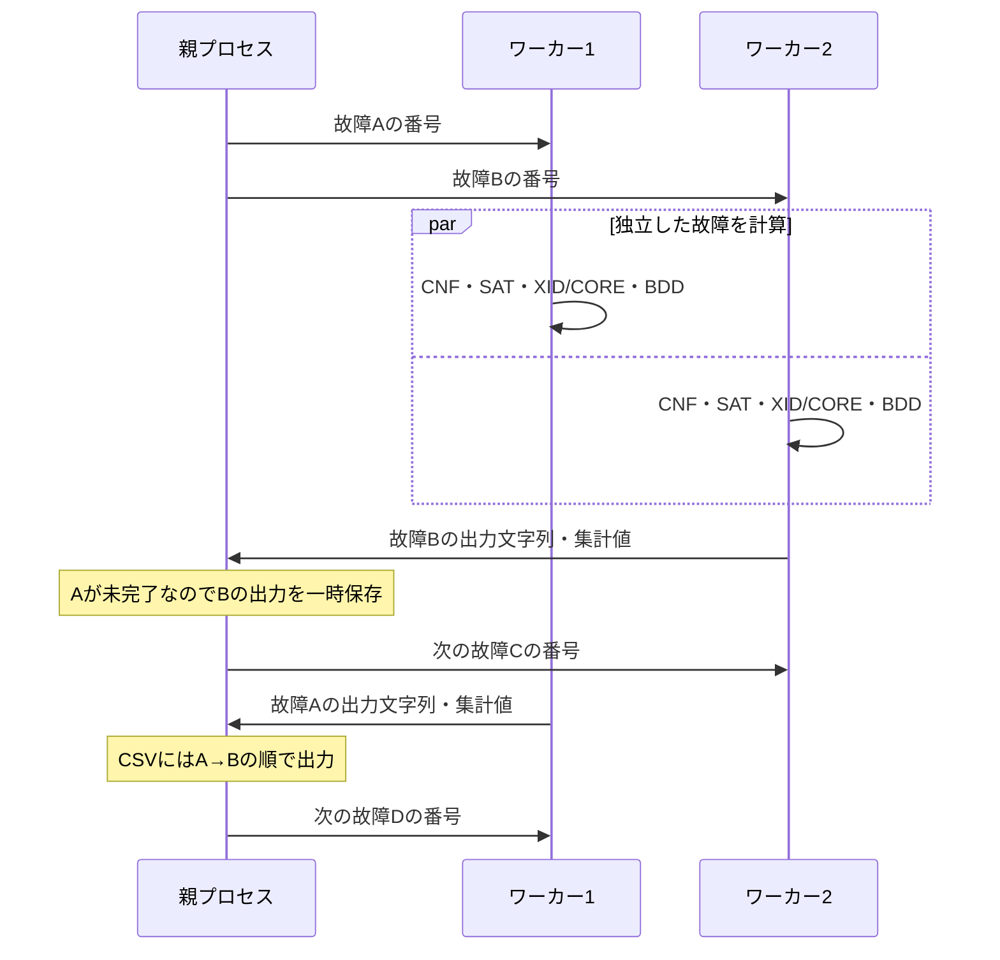

# 故障並列化コードのレビュー案内

設定はこれまでと同じです。`.set`に`-jobs 4`を書くと最大4ワーカー、
`-jobs 1`または省略で直列になります。この整理では計算手法・故障順・CSV形式を変更していません。

## 最初に読む場所

1. `src/fdp/fault_detection_prob.c`の`AnalyzeFaultDensity()`:
   回路・故障・正常CNFの準備が終わった後で、流用なしの経路を選びます。
2. 同ファイルの`AnalyzeIndependentFaults()`:
   故障順を一度決め、jobs=1では直接計算、jobs>1では`FaultPoolRun()`を呼びます。
3. `src/fdp/fault_pool.c`末尾の`FaultPoolRun()`:
   親の仕事を「起動」「配分・受信・出力」「終了・回収」「CPU集計」の順で確認できます。
4. 同ファイルの`worker_loop()`と`analyze_and_reply()`:
   子が故障を1個受け取り、共通の計算関数を呼んで返信する流れです。
5. `fault_detection_prob.c`の`AnalyzeOneFault()`:
   CNF→SAT→XID/CORE→禁止節→BDD・FDPの実際の計算です。
   SATとXIDは1故障の中では順に実行し、別の故障同士を並列に処理します。

## 親と子の役割

各ワーカーには一度に1故障を渡し、返信を受け取ると次の故障を渡します。
重い故障の処理中も、他のワーカーは次の故障へ進めます。

## 構造体の読み方と所有者

| 名前 | 置き場所・役割 |
|---|---|
| `FaultAnalysisContext` | 各プロセス専用のBDD作業領域。同じワーカー内で再利用 |
| `WorkerState` | 親が持つ、子のPID・通信口・現在担当する故障番号 |
| `FaultPool` | 親が持つ、配分位置・完了数・出力位置・全ワーカーの管理状態 |
| `FaultReply` | 子から親へ送るヘッダ。故障番号・成功可否・出力サイズ・集計値 |
| `FaultResult` | 親で出力順を待っているCSV・分析文字列。出力後に解放 |
| `FaultStats` | CPU時間・キューブ数・検証件数など。子で集計し、親が合計 |

`WorkerState`は子の計算用構造体ではありません。
子の計算用の`FaultAnalysisContext`、CNF、回路の可変フラグ、XIDのstatic作業領域は、
`fork()`で分かれた各プロセスに存在します。回路の読み取り専用ページはOSが共有でき、
書き換えたページはそのプロセス用のコピーになります（copy-on-write）。
同じアドレス値でも、子の変更が親や他の子に反映されるわけではありません。

ソルバ・キューブ集合は故障ごとに生成・解放します。BDDマネージャはfork後に生成し、
そのワーカーの担当故障をすべて処理した後、`FinishFaultAnalysis()`で解放します。

## 親側の主要な関数

| 関数 | 担当すること |
|---|---|
| `start_worker()` | 通信口を作りfork。子だけが`worker_loop()`へ進む |
| `assign_next_fault()` | 空いたワーカーに次の番号を渡す。全配分済みなら待機 |
| `collect_fault_results()` | 返信が来た通信口を待ち、受信→出力→次の配分を繰り返す |
| `receive_fault_result()` | 返信を担当故障と照合し、文字列の保存・集計・親の完了更新 |
| `write_ready_results()` | 元の故障順で出せる結果だけをファイルへ書く |
| `send_stop_requests()` | 正常時に各子へ終了番号`NO_FAULT`（-1）を渡す |
| `terminate_workers()` | 失敗・中断時に、起動済みの子へSIGTERMを送る |
| `wait_for_workers()` | 子を全員回収し、終了状態を確認。回収済みPIDを管理情報から消す |
| `free_pool_buffers()` | 出力済み・未出力を含む親のバッファを解放 |

通信は`[FaultReply][CSV文字列][分析文字列]`の順です。
`send_bytes()`と`receive_bytes()`は、一度で全バイトを送受信できない場合も最後まで処理します。
`poll()`はどの子から返信が来たかを待つために使っています。

## レビューで確認したい点

- 子へ渡す番号は固定した`faults[]`の添字で、同じ故障を二重に配分しない。
- 親と子で同じ`AnalyzeOneFault()`を使用する。XID/COREも子の中で実行する。
- 実ファイルは親だけが書き、完了順によらず故障順を守る。
- 子の出力文字列は送信後、親の文字列は出力後に解放する。
- 正常時も異常時も子を回収し、失敗した実行を成功として報告しない。
- CPU Timeは親＋全ワーカーの合計であり、実経過時間と混同しない。

回帰検証は`python3 verification/fault_pool/build.py`と
`python3 verification/fault_pool/check.py --phase regression`。今回の整理後の結果は
`results/regression.json`に記録します。
元の方式選定・制約・測定結果は[SUMMARY.md](SUMMARY.md)を参照してください。
