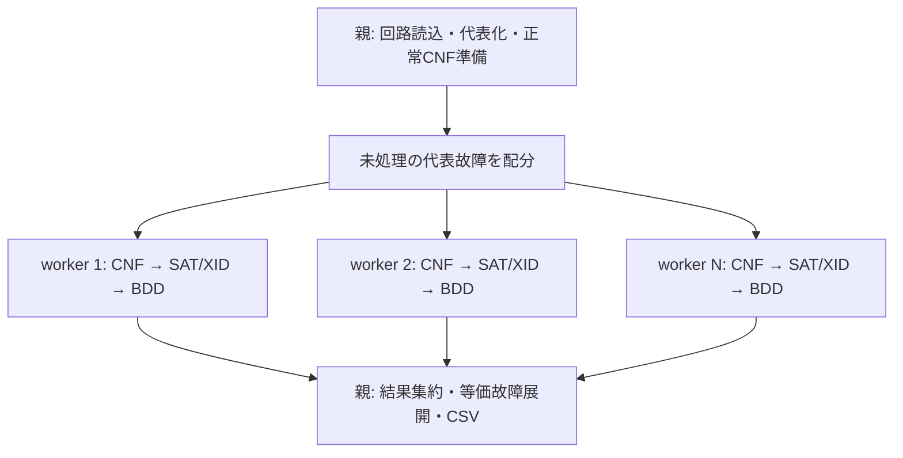

# CNF・XIDの状態分離と並列方式の比較

検討日: 2026-10-04。ユーザーは画像の実装方式に固執せず、高速化を優先する。
支配関係によるキューブ流用は効果が小さければ廃止する方針。
本書は設計検討で、本体実装は変更していない。前回の実測は[SUMMARY.md](SUMMARY.md)を参照。

## 問題の所在

正常回路のゲート種別・接続・PI順序は全故障に共通で、準備後は読み取り専用にできる。
一方、故障コーン所属・故障回路のSAT変数番号・SAT解における信号値・正当化の進捗は故障ごとに異なる。
現状はこれらの可変状態を一組だけ持ち、直列ループが順に使い直している。
直列実行で作業領域を再利用する設計は妥当だが、複数スレッドから同時利用する前提にはなっていない。

スレッドは同一プロセスのメモリを共有するため、ファイルスコープの`static`もスレッド間では共有される。
`static`は関数を呼び出すスレッドごとの領域を意味しない。
参照: [Linux pthreads](https://man7.org/linux/man-pages/man7/pthreads.7.html)。

## CNF生成で起きる競合

`src/fdp/cnf/faulty_circuit.c:SearchTFO`は、毎故障、次の順に処理する。

1. `numtrannet`と`numtranpo`を0に戻す。
2. 全`nl[].flag`を消し、`nl[].varsfc`を正常変数番号へ戻す（`init.h`）。
3. 故障コーンをたどり、`flag`、`varsfc`、`varprop`を書き換える。
4. `cnf.total.vars`を増やしながら故障用変数を採番する。
5. 後続処理がこれらを読んで、故障ゲート・D-chain・観測条件をソルバへ投入する。

例えばworker Aが故障fの変数番号を設定した後、worker Bが故障g用のリセット・採番をすると、
Aの後続処理がg用の番号やコーン情報を読む可能性がある。
solverがA/B別でも、そのsolverに入れる節を作る材料が混ざるので正しくない。
`cnf.total.vars`だけatomicにしても、異なる故障の変数対応・観測条件の整合性は保証されない。

`EssentialAssignment`も`nl[].logic_value/ea_flag/unique_flag`を更新し、
グローバル`que`、ファイルスコープの`static QUE que2`を使う。TFO探索の`stack`も共通である。
`que2`はコメントで「ローカル管理」とされているが、スレッドローカルではない。
同時呼出しでは確保したキューのポインタや解放対象が混ざる恐れがある。

正常CNFの`consgc`は一度作成した後に読み出して独立solverへ投入しているので、共有しやすい。
各solverが同じ整数の変数番号を使うことも問題ではない。番号の意味は各solver内で独立している。

## XIDで起きる競合

`src/fdp/xid/XID.c`には次の永続作業領域がある。

| 状態 | 内容 | 同時利用した場合 |
|---|---|---|
| `s_var_info` | 全信号の正常/故障2値・3値、訪問と正当化タグ | 他のSAT解の値やタグが上書きされる |
| `s_po_id` | 故障を検出したPOの一覧 | 他故障の観測先が混ざる |
| `s_fwd_q/s_bwd_q/s_jus_q` | 前方含意・後方含意・正当化待ちキュー | resetやpush/popが他workerの処理を壊す |
| `xid_lev`と要素数 | レベル別のイベントスタック | 他故障のイベントを取り出す、件数が不整合になる |
| 初期化済みフラグ・関数表 | 遅延初期化される共通データ | 初回呼出し同士が競合する |

`InlineXID`は呼出しのたびに`var_info`を初期化し、**そのsolverのSAT解**から全ネットの正常値を取り込む。
AがあるPIを正当化している最中にBがこの初期化を始めると、Aの判定途中の状態が消える。
その結果、必要なPIをXにする、正しいキューブを狭める、キューの状態を壊す、といった問題が起こり得る。
必要なPIを誤ってXにしたキューブを禁止すると、後続の探索を過剰に除外し、FDPの健全性・完全性にも影響する。

分離には追い風もある。XIDの内部関数の多くは`var_info`やキューを引数で受け取っており、
通常のXID経路は正常回路の構造と`varsgc`を読む。CNF生成の`varsfc`を直接使ってはいない。
したがって`XidContext`に状態配列・全キュー・レベルスタックをまとめ、workerごとに一度確保して使い回す設計が可能。
単に`InlineXID`内に配列を毎回mallocする設計だと、現在避けている確保/解放コストを戻してしまう。
関数表はスレッド開始前に初期化して読み取り専用にできる。

## 他にも残る共有状態

- `EXP_MaybeBuildOracle`はMAXDC無効でも`divpo_z/divpo_n`を書き換える。
- `EXP_ResetPerFault`は毎故障呼ばれ、DIVPO無効でも条件によって共有バッファのrealloc/memsetを行う。
  「実験用環境変数を設定しないから安全」とは言えない。
- MAXDCのオラクルは現在の`nl[].flag/varsfc`を参照する。DUALはこれをキューブループ中に遅延構築する。
  CNF生成関数の入口/出口だけをロックしても、これらの参照期間は保護できない。
- BDD manager、GMPのデフォルト精度、GT/PCOUNTのstatic状態、故障状態と統計、出力FILE、CPU時計も扱いを決める。
  GMP精度は開始前に一度設定するか`mpf_init2`で明示する。
  [GMP公式資料](https://gmplib.org/manual/Reentrancy.html)もデフォルト精度をグローバル状態として説明している。
- CUDD 3.0.0は別managerを別スレッドで使える（同梱`external/cudd/RELEASE.NOTES`）。
  workerごとにmanagerを持ち、共有OOMハンドラを実行中に変更しない設計が可能。

`NLIST`配列だけを浅くコピーする方法にも注意が必要。
`in/out`や`pi/po`、`FNODE.netptr/exc_netptr`は元ネットのポインタを保持するため、コピー先だけを書き換えても
参照が元配列へ戻ってしまう。スレッド版では、接続情報を共有し、可変情報をnet ID添字の別配列へ移す方が扱いやすい。

## 候補の比較

| 方式 | 改修規模の見立て | 長所 | 制約・評価 |
|---|---|---|---|
| 外部バッチプロセス | 小 | 既存実行体をそのまま利用でき、6.42倍を実測済み | バッチごとに初期処理。巨大な固定バッチは偏りが出る。CSVの代表/等価行の統合が必要 |
| 常駐プロセスプール | 中 | グローバル状態を自然に隔離。故障処理本体を再利用できる | プロセス間の配布/結果回収、終了処理、worker数に応じたメモリ管理が必要。性能は未測定 |
| worker contextを持つスレッド | 大 | 不変回路を明示的に共有できる。仕事配分・結果移動が軽い | CNF・XID・実験機能などの状態とAPIを整理する必要がある。プロセス版より速いという実測はない |
| CNF生成を直列化、XIDだけcontext化したスレッド | 中 | CNF側の広範な変更を後回しにできる | CNF準備の待ちが残る。オラクルの遅延構築等まで考慮すると対応条件が複雑になる |
| 全故障処理を一つのmutexで保護 | 小 | 共有状態の同時利用を防げる | 故障処理全体が順番待ちになり、目的の高速化を得られない |

スレッド版でもSAT内部状態・XID値配列・故障別CNF状態などはworker数ぶん必要になる。
スレッドならメモリが一組で済むという意味ではない。
プロセスとスレッドが同じ独立solverを同数動かすなら、CPU・キャッシュ・メモリ帯域の制約は両方にある。
したがって現時点では改修規模に見合う効果が確認できる**常駐プロセスプール**を本体向け第一候補とする。

## 提案する構成

Linux/WSL2向けなら、親が単一スレッドで回路・代表故障・正常CNFを準備してからforkし、
SAT solver・BDD manager・XID scratchは各workerで生成する設計が候補になる。
子は故障番号を受け取り、solverを故障ごとに作って破棄し、XID scratchとBDD managerはworker内で使い回す。
現在の実験は各バッチで実行体を起動する方式なので、このfork構成自体の実証とは区別する。

Linuxのforkはcopy-on-write方式なので、forkした瞬間に全データの物理コピーが必要になるわけではない。
読み取り専用ページは共有でき、書き込んだページが個別化される。
ただし現行`nl[]`は構造と可変状態が混在し、各故障で全ネットをリセットするため、そのページ群は個別化されやすい。
必要なら後から可変フィールドを別配列へ分けると、プロセス版にもメモリ面の利益がある。
参照: [Linux fork](https://man7.org/linux/man-pages/man2/fork.2.html)。

配分は空いたworkerへ次の故障を渡す。軽い故障は小さな束で渡して通信費を抑え、
終盤は束を小さくして待ち時間を抑える候補がある。最初から既知の難故障を後回しにしない。
fault IDは親が生成した代表リストのIDとし、故障名や回路全体を毎回送らない。
キューブ流用がなければ、親へ返すのはFDP・完了フラグ・本数・計測値などの小さい結果で足りる。
キューブやBDDノードをプロセス間転送する必要はない。`cube_analysis`指定時の系列は別途結果/一時ファイルとして扱う。

親は元の代表化情報で等価故障を展開し、fault ID順にCSVを組み立てる。
同じFILEへ各workerが直接書き込む構成にはしない。
故障カウンタ・実験統計も親で集計する。worker異常終了は親で検出し、未処理故障を完了扱いしない。
`jobs=1`と複数jobsで同じ一故障処理関数を通す形にすると、直列/並列の比較と保守が容易になる。

## 処理段階ごとの並列化について

通常の一故障内では「SAT解→XID→禁止節→次のSAT解」という依存がある。
SATとXIDを別段へ置くだけで、この故障がそのまま並行に進むわけではない。
複数故障を流す段階分割は可能だが、一方の段の処理能力が不足するとそこに待ちが集中する。

CNF生成とXIDを同じmutexで直列化すると、既存profileのs5378ではモデル準備6.006秒＋XID8.291秒、
合計約14.30秒分のサービスが一列に残る。同profileの総CPU54.603秒を用いる固定コストモデルでは、
無限workerでも倍率の上限は約3.82倍になる。ロック費用・速度変化を無視した粗い下界評価であり実測ではない。
別々のロックならこれらの段は重なり得るので、この数値をそのまま適用しない。

BDDを一つの集約段にする方式は、limit30では既存profileのBDD費用が小さいので検討できる。
ただしキューブを渡す必要があり、fullやBDD_EXACTでBDDが重くなるとそこが律速する。
最初は各workerで一故障の全パイプラインを完結させる方が、条件ごとの処理比率変化に対応しやすい。

## 高速化の優先順位

1. 支配キューブ流用を外し、一故障を完結して処理する関数を抽出する。代表化は残す。
2. 常駐プロセスで独立故障を動的配分し、結果/統計/異常終了を集約する。
3. 1/2/4/8 workerで同一条件の出力・経過時間・プロセス群のメモリを測る。
   c17ゴールデン、既存GT_BDD回帰、TDF、使用する実験モードを確認する。
4. 大回路でメモリや通信が問題になった場合、原因を測って可変配列の分離やスレッド版を検討する。

独立故障並列化と、既存`pipeline_profile`の正常CNF範囲限定は組み合わせる候補である。
後者はs5378直列で53.612→23.621秒の既存実測があるが、今回の6.42倍と単純に掛けて最終倍率を保証しない。
仕事量が変わると、並列化の粒度、CPUの利用率、共有キャッシュの競合も変わるため、併用時に測定する。

一つの故障に時間が集中するfullのケースでは、故障間並列化の限界がある。
その場合は被覆表現の改善や、入力空間の分割・補集合側など別の解法を検討する。
GPU化や一つのSAT呼出しの並列化は現行コードに直接適用できる小改修ではなく、今回の第一段階には採らない。
